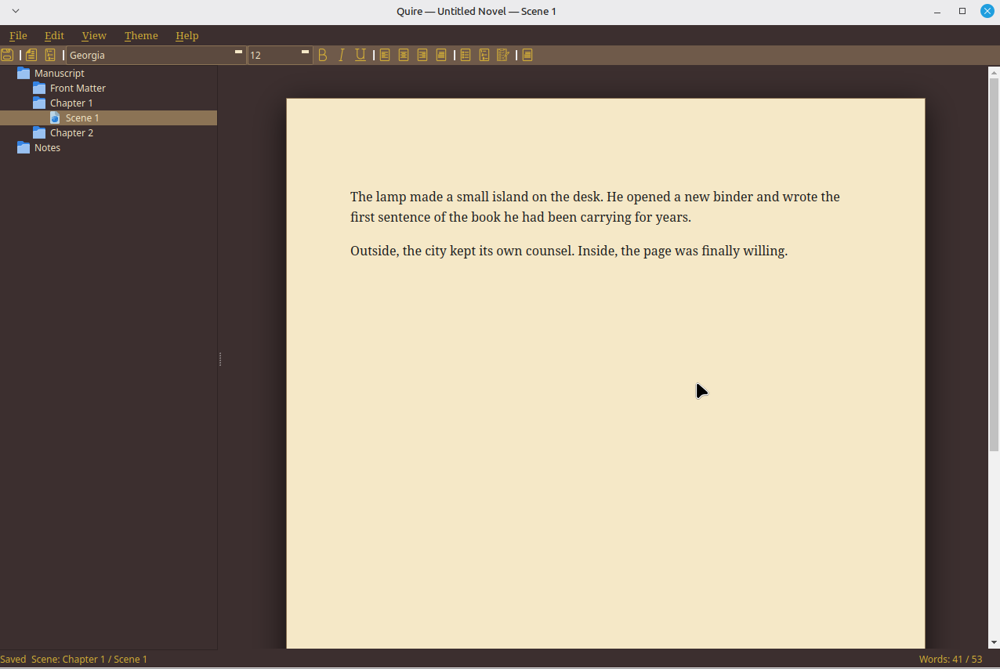

# Quire



A Linux-native novel binder. One AppImage, a folder of files you can actually see, and a page that looks like paper.

Binder on the left, page in the middle, compile when the book is ready. C++/Qt6, one executable, no installer, no cloud. Built as a lighter alternative for people who write on Linux and want their manuscript as ordinary files. Drop the AppImage next to a `Manuscripts` folder and write.

## Why it exists

A novel is not one document. It is chapters, scenes, notes you never want in the Kindle TOC, and a compile order you can rearrange without renaming files. A word processor flattens that. Dedicated binders usually mean another OS, or Wine.

Quire is the Linux-native version of that binder: small, portable, yours. The project is a directory. Scenes are HTML files. Notes are a second root that never compiles. Compile writes EPUB3 for Kindle and a Word `.docx` fallback that Amazon’s converter will not turn into a scene index.

## Features

**Binder.** Manuscript on top, Notes underneath. Chapters are folders at manuscript root (never nested under the current chapter), or top-level `.html` files in a flat binder. Nested scenes stay body text under the folder Heading 1; a file sitting on the manuscript root is itself a chapter. Ctrl+Up / Ctrl+Down reorder siblings. Uncheck Include in Compile to skip a scene or a whole folder; excluded items stay in the tree, dimmed.

**The page.** The Monastery editor: Gelasio (OFL, Georgia-metric) at 12pt on parchment. Georgia in a manuscript maps to the same bundled faces. Bold, italic, underline, lists, alignment, font family/size. CUPS print to paper or PDF — ink on white, not the leather desk.

**Notes.** Research, characters, scraps. Same editor. They never join compile order, never become Kindle TOC entries, and manuscript Find does not search them.

**Compile.** One action writes four files:
- `manuscript.epub` — EPUB3, the file you upload to KDP for Kindle (Gelasio faces embedded)
- `manuscript.docx` — Kindle Create / Word-converter fallback (Heading 1 on chapter titles only; scenes stay body; Times New Roman; scene break is a centered `#`)
- `manuscript.pdf` — paperback interior at 5×8 trim (Gelasio; not File→Print)
- `manuscript.html` — a readable dump of the same order, with Gelasio beside it

**Find.** Ctrl+F walks every manuscript scene in binder order. Uncheck Manuscript to search only the open page.

**Import.** File → Import… (or the binder menu) turns `.html`, `.md`, `.txt`, and `.docx` into scenes.

**Scrivener.** File → Import Scrivener Project copies a `.scriv` binder into a new `.qr` (chapters, scenes, research notes, compile-include flags). The original project is left untouched.

**Focus.** F11 hides the binder and the format toolbar. Escape comes back. Ctrl+PageUp / Ctrl+PageDown (or Alt+Left / Alt+Right) move to the previous/next scene even while focused.

**Recent.** File → Open Recent remembers eight projects.

**Portable.** New Project names the folder `Snowflake.qr` for a book titled Snowflake. The suffix marks a Quire project; the title inside stays Snowflake. The AppImage keeps novels in a `Manuscripts` folder next to itself, so the same Dropbox tree works on every Linux box you own.

**Word count.** Status bar shows the open scene and the included manuscript: `Words: 41 / 53`.

## A project on disk

```
Snowflake.qr/
  quire.json      title, author, compile order, exclude list
  manuscript/     Front Matter, chapters, scenes as .html
  notes/          research .html — in the binder, never compiled
  compile/        manuscript.html, manuscript.epub, manuscript.docx, manuscript.pdf
  .autosave/      dirty-scene backups only
```

`quire.json` is the manifest. `order` is relative paths under `manuscript/`. Rearrange in the binder and the files keep their names. Rearrange in a file manager and Quire will still see the files, but a moved scene may land at the end of the binder instead of where you put it. Prefer the binder.

Open any folder that contains `quire.json`. The `.qr` suffix is a marker, not a requirement — older unsuffixed projects still open.

## Kindle / KDP

Upload the EPUB3. That is the Kindle book.

The `.docx` is a fallback for Kindle Create and Amazon’s Word converter. It is not a paperback interior.

- Heading 1, centered, on chapter titles only (Kindle’s Go-to TOC)
- Scene titles stay body text
- Title page, page break before each chapter
- First-line indent, no headers/footers/page numbers/cover
- Scene break is a centered `#`

`manuscript.pdf` from Compile is the paperback interior at **5×8** (QuireRoman, mirrored gutter 0.875in, page numbers after front matter). File→Print stays CUPS/Brother draft printing — do not use Print-to-PDF as the book.

## Run

A packed AppImage is the intended way to run it. Put `Quire.AppImage` wherever you keep tools. New novels default to `Manuscripts/` beside that AppImage.

## Build

Qt 6, C++17, WebEngine, Hunspell, minizip, zlib.

```
cmake -S . -B build
cmake --build build
./build/Quire
```

If CMake cannot find WebEngineWidgets: `sudo apt install qt6-webengine-dev`.

## Status

0.3.28. Compile also writes `manuscript.pdf` (5×8 paperback interior). File→Print stays CUPS/Brother; Print Current Scene… is the one-page editor print. Usable for a real draft.

Not a corkboard. Not a port of someone else’s app. Linux first.
